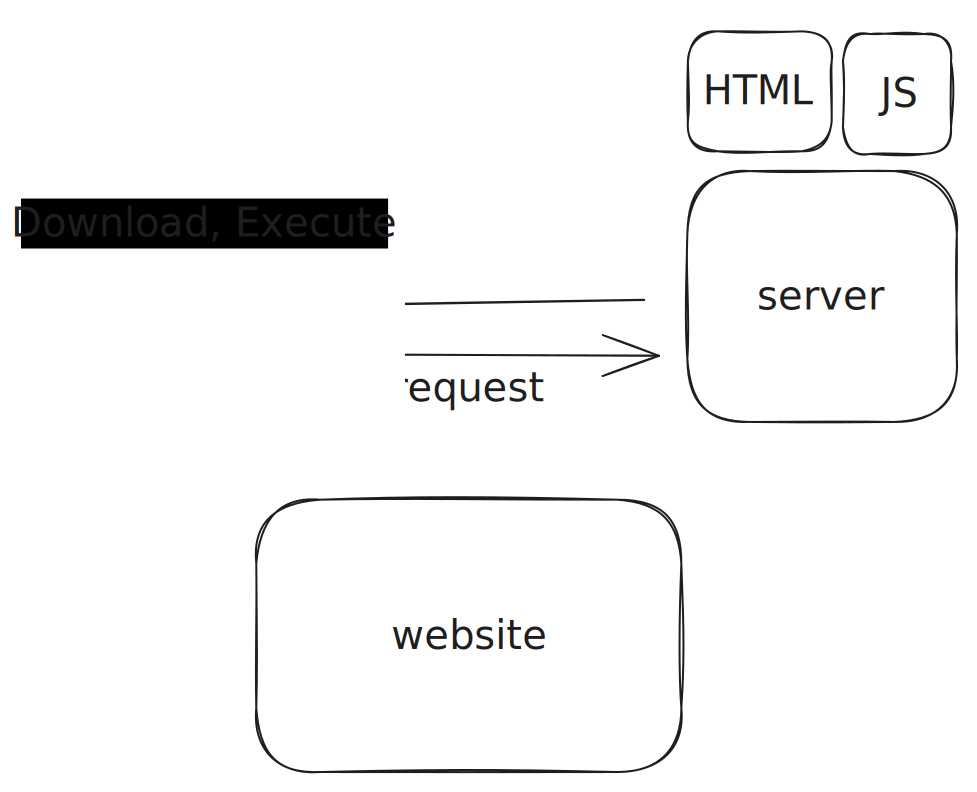
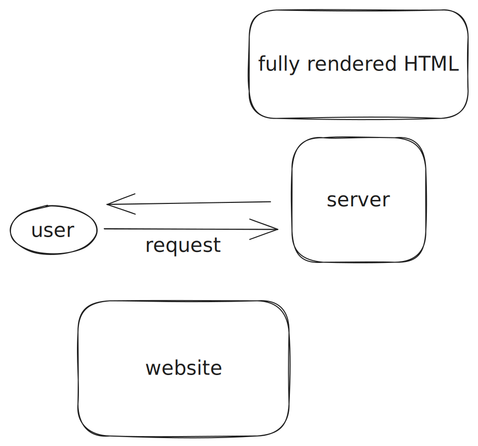

# Next.js

## The Benefits of Next.js

-   Next.js simplifies the development process
-   On top of that it optimizes your web apps

It does that through it's primary features.

## Rendering

It all begins with the rendering process.

-   React &rarr; Client-side rendering
-   Next &rarr; Server-side rendering

Next.js offers flexibility in rendering options you can choose to render the UI on the client-side or server-side
according you needs.

## Client-side Rendering or Browser Rendering

When a user requests a web page the server sends a basic HTML document and JavaScript code. The browser then downloads
and executes the JavaScript code which leads to the rendering of components and finally the display of the website.



## Server-side Rendering

-   Rendering the web page on the server.
-   Before transmitting it to the client's device.

When a user request a page the server process the request and renders the components on the server side. The server then
sends back the fully rendered HTML is the client's browser enabling immediate display.



This distinction highlights on essential aspect of Web Developments.

## Search Engine Optimization (SEO)

Search engine crawler face difficulties indexing pages dynamically rendered on the client side as a result the SEO
performance of such pages may suffer as search engines may not fully comprehend their content and rank them
appropriately by utilizing next.js this issue is resolved by sending pre-rendered code directly to the client.

This enables :

-   Easy crawling
-   Indexing

Leading to improved SEO

SEO is crucial for optimizing a website's visibility and ranking in search engine results.

You can achieve serval benefits, including

-   Increased organic traffic
-   Enhanced user experience
-   Credibility and trustworthiness
-   Competitive advantage

Prioritizing SEO can greatly impact the Success of your website and its online presence.

## Search Systems

Search Systems are what you typically refer to as Search Engines (Google, Bing, DuckDuckGo, etc.). They are massively
complex systems that tackle some of the biggest challenges in technology history.

Search Systems have four main responsibilities:

1. Crawling – the process of going through the Web and parsing the content in all websites. This is a massive task as
   there
   are over 350 million domains available.
2. Indexing – finding places to store all of the data gathered during the crawling stage so it can be accessed.
3. Rendering – executing any resources on the page such as JavaScript that might enhance the features and enrich content
   on
   the site. This process doesn't happen for all pages that are crawled and sometimes it happens before the content is
   actually indexed. Rendering might happen after indexing if there are no available resources to perform the task at
   the
   time.
4. Ranking – querying data to craft relevant results pages based on user input. This is where the different ranking
   criteria are applied in Search engines to give users the best answer to fulfill their intent.

## Routing

-   Next.js uses file-based routing system which means that the routing is handled by the file system. Each folder in the
    app directory becomes a route and the folder name ecomes the routes path.
-   No need for external packages or complex configuration.
-   You can create file for the route you want and immediately open them within you application.

|  file   | route                         |
| :-----: | :---------------------------- |
|   app   | http://localhost:3000         |
|  blog   | http://localhost:3000/blog    |
|  about  | http://localhost:3000/about   |
| profile | http://localhost:3000/profile |
| service | http://localhost:3000/service |

## API Routes

From Next.js version 9 \
Developers behind Next.js introduced a new feature API route.

Enabling the creation of serverless functions to handle API requests.

Serverless APIs in Next.js are a way of creating API endpoints. Without the need for a traditional server. It allows
us to build and deploy APIs.

-   Without managing server infrastructure
-   Worrying about scaling their server as traffic increases

With this feature, we can create API endpoints by simply creating a file called route.js in a specific folder within the
app directory this file in any route segment of the app directly corresponds to that route API endpoint

## Automatic Code Splitting

### Code Splitting

Code splitting is a technique that breaks down large bundles of JavaScript code into smaller, more manageable chunks
that can be loaded as needed.

### When need

This reduces the initial load time of a website and optimizes the user's experience while browsing.

### Code Splitting in React

We can achieve code splitting in react the process is manual. We have to do lots of configuration as your application
grows

```javascript
const About = lazy(() => import("./About"));

const App = () => {
	return (
		<Suspense fallback={<div>Loading...</div>}>
			<Text>Hello World!</Text>
		</Suspense>
	);
};
```

### Code Splitting in Next.js

This process is entirely automatic no need for any code. It uses automatic code splitting by default to split pages into
separate chunks

## Frontend development has gone through various advancements

-   Linting
-   Formatting
-   Compiling
-   Bundling
-   Minifying
-   Deploying

To avoid the time spent configuring these tools. Developers felt a need for a framework that would take care of most of
the process automatically. Leaving them to concentrate on the actual code.

-   Automating most of the remaining process
-   Letting us focus on building the essential business logic of the application
